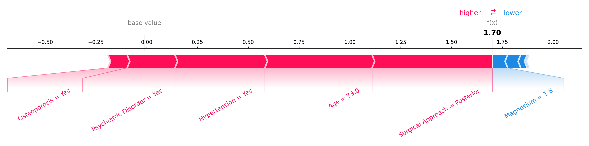
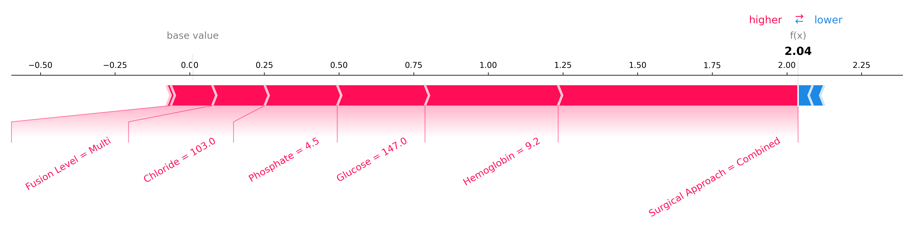

# Predictive Models for Lumbar Fusion Surgery Outcomes

[](https://www.python.org/downloads/)
[](https://opensource.org/licenses/MIT)

This repository provides inference-ready XGBoost models for two outcomes after elective lumbar fusion surgery:

- Non-home discharge
- Prolonged length of stay (LOS >= 7 days)

## Scope of This Repository

This repository is inference-only.

- Includes: pretrained XGBoost models and inference notebooks
- Excludes: training pipeline and original training dataset
- For training/retraining resources: please contact the authors

## Data Note (Important)

The file `Data/sample_synthetic.csv` is synthetic sample data used for demonstration and evaluation of the inference notebooks.

- It is generated to be similar in structure to MIMIC-IV style clinical data
- It is not MIMIC-IV data
- This is intentional due to data ethics and privacy constraints

When using this repository, external users should run inference with their own appropriately prepared data.

## Repository Structure

```text
.
├── Data/
│   └── sample_synthetic.csv
├── lumbar_los/
│   ├── inference.ipynb
│   ├── models/xgb_model.json
│   └── shap_force_plots/
├── lumbar_discharge/
│   ├── inference.ipynb
│   ├── models/xgb_model.json
│   └── shap_force_plots/
├── requirements.txt
└── README.md
```

## Quick Start

### 1. Environment Setup

```bash
conda create -n lumbar python=3.10 -y
conda activate lumbar
pip install -r requirements.txt
```

### 2. Run Inference Notebook

For LOS prediction:

```bash
cd lumbar_los
jupyter notebook inference.ipynb
```

For discharge prediction:

```bash
cd lumbar_discharge
jupyter notebook inference.ipynb
```

In each notebook, update the input path if needed:

```python
INPUT_PATH = Path("../Data/sample_synthetic.csv")
HAS_LABELS = True  # set False if your file has no ground-truth column
```

## What the Inference Notebooks Do

Both notebooks follow the same inference flow:

1. Load a pretrained XGBoost model from `models/xgb_model.json`
2. Load raw CSV data
3. Apply preprocessing in-notebook (StandardScaler + OneHotEncoder)
4. Select model features, run prediction, and output probabilities
5. If labels are available: report AUC, accuracy, precision, recall, F1, confusion matrix
6. Generate SHAP visualizations:
  - Global beeswarm plot
  - Local force plots for selected correct predictions

## Input Requirements by Notebook

The notebooks expect raw (not pre-encoded) columns.

### lumbar_discharge/inference.ipynb

Required raw features:

- `age_at_admit`
- `hgb`
- `magnesium`
- `marital_status`
- `gender`
- `surgical_approach_group`
- `osteoporosis`
- `psych`
- `htn`

Optional label column:

- `discharge_disposition` (0 = home, 1 = non-home)

### lumbar_los/inference.ipynb

Required raw features:

- `hgb`
- `glucose`
- `chloride`
- `phosphate`
- `wbc`
- `surgical_approach_group`
- `renal`
- `level_group`
- `anticoagulant_use`

Optional label column:

- `los_class` (0 = short LOS, 1 = prolonged LOS)

Note: the LOS notebook includes a placeholder reminder to update its selected feature list according to the corresponding LOS model setup.

## Example SHAP Force Plots

Sample outputs generated by the notebooks:

### Discharge task example



### LOS task example



## Output Artifacts

Notebook outputs include:

- Printed prediction metrics (when labels exist)
- ROC curve figure
- SHAP beeswarm figure (`shap_beeswarm_XGB.png`)
- SHAP force plots in `shap_force_plots/`

## Contact

For access to training code/pipelines or original datasets, please contact the authors.
